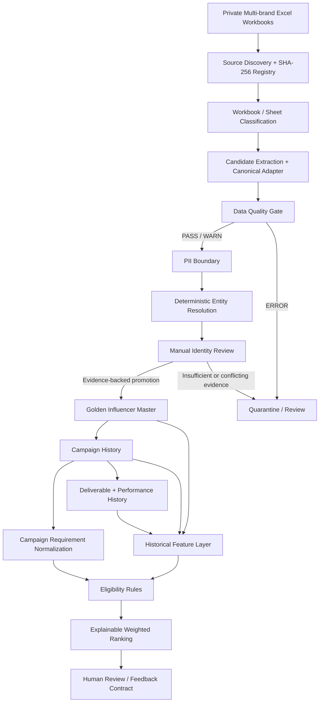

# Architecture v2 — As-Built Influencer Campaign Intelligence Pipeline

## Status

**Current-state / as-built portfolio architecture.**

Architecture v1 is preserved as the approved implementation foundation. This v2 document describes the system that was actually implemented and tested after the Golden Master, campaign/performance history, explainable matching, reliability, PostgreSQL, Docker, and CI/CD extensions.

This project is a **portfolio / production-like engineering lab**, not a claim of real production ownership.

---

## Business Goal

Transform heterogeneous private influencer campaign workbooks into:

```text
Trusted Influencer Master
→ Governed Campaign / Deliverable / Performance History
→ Reusable Historical Evidence
→ Explainable Campaign Matching
→ Human Review / Feedback Readiness
```

while preserving provenance, preventing unsafe identity merges, protecting PII, and making pipeline correctness testable and reproducible.

---

## Architecture Overview



The implemented system is best understood as four cooperating planes:

```text
Data Plane
+ PostgreSQL Warehouse Plane
+ Reliability / Control Plane
+ CI/CD Runtime Plane
```

---

## 1. Data Plane

### 1.1 Source Discovery and Profiling

Implemented modules include:

- `src/discover_sources.py`
- `src/xlsx_probe.py`
- `src/build_sheet_inventory.py`
- `src/sheet_classifier.py`

Responsibilities:

- discover expected source files;
- calculate source-level SHA-256 evidence;
- inspect workbook and sheet structure;
- classify source sheets;
- preserve source-level lineage;
- detect source-boundary failures such as missing or duplicate workbooks.

### 1.2 Canonical Ingestion

Implemented modules:

- `src/extract_candidate_observations.py`
- `src/candidate_adapter.py`

Responsibilities:

- detect variable candidate headers;
- handle repeated sections and schema boundaries;
- map heterogeneous source fields into canonical observations;
- preserve raw and normalized representations where required;
- prevent malformed or invalid observations from silently entering governed layers.

Canonicalization is contract-driven through public-safe configuration such as:

- `config/candidate_column_contract.json`
- `config/sheet_classification_rules.json`
- `config/source_registry.example.yml`

### 1.3 Data Quality and PII Boundary

Implemented control:

- `src/pii_guard.py`

The pipeline separates execution success from data correctness:

```text
Pipeline completed
        ≠
Data is trusted
```

Records must satisfy explicit Data Quality rules before governed promotion.

```text
PASS / WARN
→ governed downstream processing

ERROR
→ quarantine / review
```

Raw company workbooks, PII, private source mappings, and source-derived private evidence are excluded from the public repository.

### 1.4 Deterministic Entity Resolution

Implemented modules include:

- `src/build_deterministic_identity_clusters.py`
- `src/build_identity_review_queue.py`
- `src/enrich_identity_review_evidence.py`
- `src/corroborate_identity_review.py`
- `src/scan_identity_source_evidence.py`
- `src/validate_identity_review_decisions.py`

Entity-resolution order:

```text
Normalize
→ Exact Match
→ Deterministic Rules
→ Alias Evidence
→ Manual Review
```

Fuzzy similarity is not allowed to automatically merge identities.

Ambiguous or conflicting observations remain outside the Golden Master until explicit evidence supports a controlled decision.

### 1.5 Golden Influencer Master

Implemented modules:

- `src/build_resolved_candidate_observations.py`
- `src/promote_golden_master.py`

The Golden Master establishes stable influencer identities and retains alias/provenance evidence.

Governed project evidence demonstrates:

```text
703 Golden Influencer Master records
2,519 alias-provenance rows
163 Golden records observed across multiple workbooks
```

Unresolved identities remain outside the Golden Master rather than being silently merged.

### 1.6 Campaign, Deliverable, and Performance History

Implemented modules:

- `src/build_campaign_history.py`
- `src/deliverable_performance.py`
- `src/build_deliverable_performance_history.py`

Business grains remain separate rather than forcing all metrics into one table.

Governed project evidence includes:

```text
12 brands
19 campaign source instances
989 campaign × influencer facts
494 canonical deliverables
515 influencer performance snapshots
1,260 campaign-level performance records
```

Metric semantics such as views, GMV, sales amount, revenue, ROI, and ROAS are not treated as interchangeable.

### 1.7 Historical Feature Layer

Implemented modules:

- `src/historical_features.py`
- `src/build_historical_features.py`

The feature layer produces reusable historical evidence per Golden Master influencer.

It does not automatically convert historical evidence into a recommendation.

Feature families include campaign experience, cross-brand experience, selection history, fee evidence, content-performance evidence, operational reliability evidence, and data-confidence / DQ evidence.

### 1.8 Campaign Requirement Normalization

Implemented modules:

- `src/requirement_normalization.py`
- `src/build_requirement_fit_layer.py`

This layer converts explicit campaign brief evidence into deterministic governed dimensions.

It does not silently inherit missing requirements between campaigns.

Public-safe taxonomy and configuration are stored outside business logic.

### 1.9 Explainable Matching

Implemented modules:

- `src/matching.py`
- `src/run_explainable_matching.py`
- `src/matching_v2.py`
- `src/run_explainable_matching_v2.py`

Processing order:

```text
Campaign Requirement
        +
Historical Evidence
        ↓
Eligibility Rules
        ↓
Active Configurable Weights
        ↓
Component Scores
        ↓
Weighted Total
        ↓
Deterministic Rank
        ↓
Reasons + Cautions
```

Matching v2 excludes the target campaign from historical inputs before aggregation to prevent target-campaign leakage.

Current historical replay evidence includes:

```text
12 fit-ready target campaigns
8,436 scenario × influencer score rows
360 shortlist rows
0 target-campaign leakage audit failures
```

Machine learning remains intentionally out of scope until sufficient governed outcome data exists.

### 1.10 Human Review and Feedback Boundary

Implemented modules:

- `src/build_feedback_templates.py`
- `src/feedback_loop.py`

The matching engine provides decision support rather than silently making campaign decisions.

```text
Explainable Shortlist
→ Human Review
→ Selected / Rejected / Hold
→ Campaign Result Capture
→ Feedback Readiness Gate
```

No synthetic campaign outcome is represented as real business feedback.

---

## 2. PostgreSQL Warehouse Plane

The persistent analytical warehouse uses four logical schemas:

```text
stg
→ text-first staging / landing

core
→ typed governed dimensions and facts

mart
→ analytical views with grain protection

ops
→ pipeline run, incremental state, and DQ evidence
```

Implemented SQL migrations:

- `sql/postgres/001_schemas_and_helpers.sql`
- `sql/postgres/002_staging_tables.sql`
- `sql/postgres/003_core_tables.sql`
- `sql/postgres/004_incremental_upserts.sql`
- `sql/postgres/005_reconciliation.sql`
- `sql/postgres/006_mart_views.sql`

Warehouse execution modules:

- `src/warehouse_contract.py`
- `src/build_postgres_warehouse_stage.py`
- `src/postgres_warehouse_runtime.py`
- `src/run_postgres_warehouse.py`

The warehouse preserves business-key constraints, referential integrity, idempotent upsert behavior, run state, DQ evidence, and analytical grain.

---

## 3. Incremental and Idempotency Control

The warehouse runner uses a deterministic batch fingerprint.

```text
Incoming governed batch
        ↓
SHA-256 batch fingerprint
        ↓
Compare successful incremental state
        │
        ├── Same batch
        │      ↓
        │    SKIPPED
        │    no duplicate load
        │
        └── New batch
               ↓
             STAGING
               ↓
             UPSERT
               ↓
          RECONCILIATION
               ↓
             SUCCESS
               ↓
        advance incremental state
```

The same successful batch can therefore be replayed without duplicating warehouse state.

---

## 4. Reliability Plane

### 4.1 Controlled Source Failure Lab

Implemented through:

- `src/reliability_lab.py`
- `src/run_reliability_failure_lab.py`

Controlled cases include missing workbook, duplicate workbook content, schema drift, empty expected sheet, and same-batch rerun.

### 4.2 Operational Reliability

Implemented through:

- `src/operational_reliability.py`
- `src/run_operational_reliability_lab.py`

Controls include bad incremental state detection, staging versus committed output boundary, partial-load recovery, bounded retry, idempotent commit protection, run telemetry, and simulated alert evidence.

### 4.3 Temporal Reliability

Implemented through:

- `src/temporal_reliability.py`
- `src/run_temporal_reliability_lab.py`

Controls include late-arriving-data detection, watermark validation, bounded backfill, idempotent replay, freshness / completeness / watermark SLO evidence, and recovery reconciliation.

Synthetic arrival metadata used by the controlled lab is explicitly separated from real source metadata.

---

## 5. Docker Runtime

`compose.yaml` provides a reproducible PostgreSQL `18.6` runtime.

```text
Host
  ↓
Docker Compose
  ↓
PostgreSQL 18.6
  ↓
Named persistent volume
  ↓
stg / core / mart / ops
```

Persistence and recovery tests demonstrated that warehouse state survives controlled container stop/start and container recreation when the named volume is preserved.

The local `.env` contains runtime secrets only and is gitignored.

`.env.example` contains public-safe placeholders.

---

## 6. CI/CD Control Plane

GitHub Actions provides two independent hosted quality gates.

```text
Push / Pull Request
        ↓
GitHub Actions
        │
        ├── Fast Quality Gate
        │     ├── Python setup
        │     ├── dependency install
        │     ├── compileall
        │     ├── 155 automated tests
        │     └── Docker Compose validation
        │
        └── PostgreSQL Integration Gate
              ├── PostgreSQL 18.6 service
              ├── public-safe synthetic fixture
              ├── real warehouse execution
              ├── first load = SUCCESS
              ├── identical rerun = SKIPPED
              ├── row-count reconciliation
              └── temporary integration DB cleanup
```

Integration assets:

- `tests/integration/generate_postgres_integration_fixture.py`
- `tests/integration/run_postgres_integration.py`

The PostgreSQL integration test does not use private company-derived load-ready data.

---

## 7. Configuration Plane

Business and operational behavior is kept outside hard-coded execution logic where appropriate.

Tracked public-safe configuration includes:

```text
candidate column contracts
sheet classification rules
campaign mappings
deliverable mappings
feedback configuration
historical feature configuration
matching v1/v2 configuration
requirement taxonomy
source registry example
failure-lab configuration
operational reliability configuration
temporal reliability configuration
warehouse configuration
```

Private source mappings and secrets remain outside the public repository.

---

## 8. Data Model

The PostgreSQL business model is documented separately in:

`docs/warehouse/postgresql_warehouse_erd_v1.md`

Primary business entities include:

```text
Influencer
Identity Alias
Brand
Campaign
Campaign Requirement
Campaign × Influencer
Deliverable
Influencer Performance
Campaign Performance
```

Operational warehouse entities are intentionally separated under the `ops` schema.

---

## 9. Testing Architecture

The repository currently contains:

```text
155 automated test functions
+
real PostgreSQL integration harness
+
Docker Compose validation
+
hosted GitHub Actions execution
```

Testing covers more than happy-path execution.

The project exercises:

```text
Positive
Negative
Missing
Duplicate
Invalid
Schema Drift
Incremental
Retry
Rerun
Failure
Recovery
Reconciliation
Regression
```

The governing principle remains:

```text
Pipeline SUCCESS != Data Correct
```

---

## 10. Security and Public Portfolio Boundary

```text
Private Company Data
        ↓
PII / sensitivity boundary
        ↓
Private processing and evidence
        │
        ├── never public:
        │     raw workbooks
        │     real PII
        │     private mappings
        │     source-derived private evidence
        │     local credentials
        │
        └── public portfolio:
              source code
              contracts
              synthetic fixtures
              anonymized aggregate evidence
              tests
              architecture
```

---

## 11. As-Built Engineering Principles

1. Preserve provenance before optimization.
2. Treat pipeline execution and data correctness as separate outcomes.
3. Quarantine invalid or ambiguous data instead of silently overwriting it.
4. Resolve identity deterministically before considering fuzzy or probabilistic methods.
5. Keep matching explainable and configuration-driven.
6. Exclude target outcomes from historical scoring inputs.
7. Make reruns idempotent.
8. Reconcile row counts, grains, keys, and references after processing.
9. Test both happy and controlled failure paths.
10. Require evidence before claiming root cause or recovery.
11. Keep secrets, PII, and company-derived raw data outside the public repository.
12. Add infrastructure or distributed tools only when the architecture problem justifies them.

---

## 12. Current Boundaries and Deferred Extensions

The current architecture intentionally does **not** claim:

- real production deployment ownership;
- real production incident response experience;
- production SLA commitments;
- automatic ML-based recommendation;
- automatic fuzzy identity merging;
- Airflow orchestration;
- Spark / Databricks processing;
- Kafka / streaming ingestion;
- cloud-managed infrastructure;
- enterprise MDM platforms such as SAP MDG or Informatica.

These are future extensions only when justified by workload, architecture, or target job-market requirements.

---

## 13. Architecture Evolution

```text
Architecture v1
Initial governed ingestion / identity / master-data foundation
        ↓
Campaign + Performance History
        ↓
Historical Features
        ↓
Explainable Matching
        ↓
Reliability Failure Labs
        ↓
Operational + Temporal Reliability
        ↓
Persistent PostgreSQL Warehouse
        ↓
Docker Reproducibility / Recovery
        ↓
Hosted GitHub Actions CI/CD
        ↓
Architecture v2
Current as-built system
```

This evolution is deliberately preserved rather than rewriting Architecture v1 after the fact.
