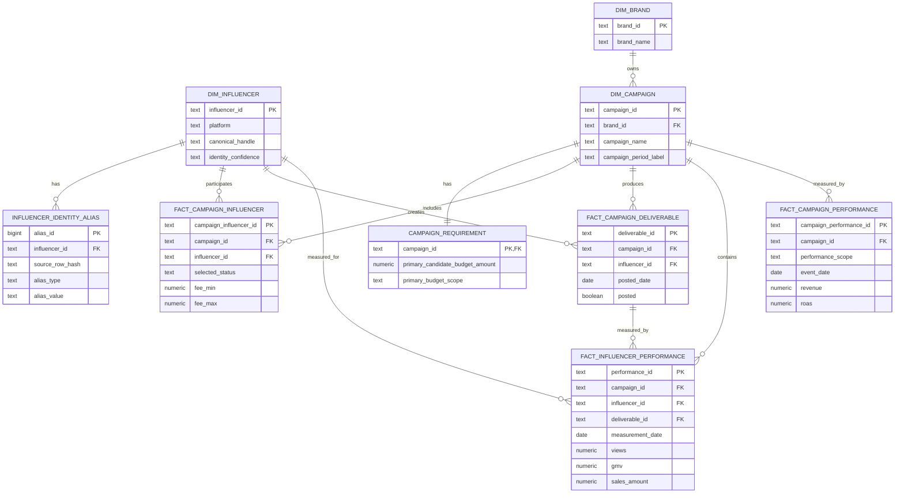

# PostgreSQL Warehouse v1 — ERD

```mermaid
erDiagram
    DIM_INFLUENCER ||--o{ INFLUENCER_IDENTITY_ALIAS : has
    DIM_BRAND ||--o{ DIM_CAMPAIGN : owns
    DIM_CAMPAIGN ||--|| CAMPAIGN_REQUIREMENT : has
    DIM_CAMPAIGN ||--o{ FACT_CAMPAIGN_INFLUENCER : includes
    DIM_INFLUENCER ||--o{ FACT_CAMPAIGN_INFLUENCER : participates
    DIM_CAMPAIGN ||--o{ FACT_CAMPAIGN_DELIVERABLE : produces
    DIM_INFLUENCER ||--o{ FACT_CAMPAIGN_DELIVERABLE : creates
    FACT_CAMPAIGN_DELIVERABLE ||--o{ FACT_INFLUENCER_PERFORMANCE : measured_by
    DIM_CAMPAIGN ||--o{ FACT_INFLUENCER_PERFORMANCE : contains
    DIM_INFLUENCER ||--o{ FACT_INFLUENCER_PERFORMANCE : measured_for
    DIM_CAMPAIGN ||--o{ FACT_CAMPAIGN_PERFORMANCE : measured_by

    DIM_INFLUENCER {
        text influencer_id PK
        text platform
        text canonical_handle
        text identity_confidence
    }
    INFLUENCER_IDENTITY_ALIAS {
        bigint alias_id PK
        text influencer_id FK
        text source_row_hash
        text alias_type
        text alias_value
    }
    DIM_BRAND {
        text brand_id PK
        text brand_name
    }
    DIM_CAMPAIGN {
        text campaign_id PK
        text brand_id FK
        text campaign_name
        text campaign_period_label
    }
    CAMPAIGN_REQUIREMENT {
        text campaign_id PK,FK
        numeric primary_candidate_budget_amount
        text primary_budget_scope
    }
    FACT_CAMPAIGN_INFLUENCER {
        text campaign_influencer_id PK
        text campaign_id FK
        text influencer_id FK
        text selected_status
        numeric fee_min
        numeric fee_max
    }
    FACT_CAMPAIGN_DELIVERABLE {
        text deliverable_id PK
        text campaign_id FK
        text influencer_id FK
        date posted_date
        boolean posted
    }
    FACT_INFLUENCER_PERFORMANCE {
        text performance_id PK
        text campaign_id FK
        text influencer_id FK
        text deliverable_id FK
        date measurement_date
        numeric views
        numeric gmv
        numeric sales_amount
    }
    FACT_CAMPAIGN_PERFORMANCE {
        text campaign_performance_id PK
        text campaign_id FK
        text performance_scope
        date event_date
        numeric revenue
        numeric roas
    }
```

Operational tables (`ops.pipeline_run`, `ops.incremental_state`, `ops.data_quality_result`) are intentionally separated from analytical business entities.
