# Business-Context Lineage Example

## Purpose

This public-safe example shows how business meaning and provenance flow through the completed pipeline without exposing private company data.

All identifiers and source labels below are synthetic.

## Signature lineage

```text
Synthetic Workbook / Sheet / Row
        ↓
Source Identity Observation
        ↓
Normalized Handle / Alias Evidence
        ↓
Canonical Influencer ID
        ↓
Campaign Participation + Performance Observation
        ↓
Target-Excluded Historical Feature
        ↓
Matching Component
        ↓
Weighted Candidate Score + Reasons
        ↓
Human Review Decision
```

## Synthetic trace

```text
synthetic_workbook_A.xlsx / Candidates / row 12
→ obs_syn_001
→ normalized_handle = creator_alpha
→ alias evidence links to inf_syn_001
→ core.dim_influencer.influencer_id = inf_syn_001
→ campaign history excludes target campaign before aggregation
→ campaign_count_ex_target = 4
→ historical_experience_score = 80/100
→ total matching score = 77.833333...
→ rank = 1
→ human decision remains pending until reviewer action
```

## Technical anchors

| Lineage step | Implemented evidence |
|---|---|
| Source identity | canonical contract fields such as file/sheet/row, raw handle/profile URL, normalized handle, parse status |
| Alias provenance | `core.influencer_identity_alias.source_filename`, `source_sheet_name`, `source_row_number`, `source_row_hash`, `match_method` |
| Canonical master | `core.dim_influencer.influencer_id`, `canonical_handle`, resolution method/confidence, source occurrences |
| Campaign history | `core.fact_campaign_influencer` with unique `(campaign_id, influencer_id)` and history DQ state |
| Performance | `core.fact_influencer_performance` with measurement scope/date, metric-definition version, source-row lineage |
| Historical context | `src/matching_v2.py::build_target_excluded_context` excludes target rows before aggregation |
| Feature score | matching components are computed from governed target requirement + target-excluded historical evidence |
| Explanation | `positive_reasons`, `cautions`, eligibility reasons, leakage guard status |
| Human decision | reviewer-owned decision contract; ranking never auto-selects a creator |

## Why this matters

The same creator representation can appear differently across sources. The pipeline therefore does not treat a raw string as a business key. It preserves evidence, resolves identity under deterministic/reviewed rules, carries the stable `influencer_id` into history, and makes the matching explanation traceable back to approved feature definitions.

## Semantic boundaries

- Source/company filenames shown here are synthetic labels only.
- Private raw workbook rows are not published.
- Target-campaign outcome evidence is not allowed to leak into its replay score.
- `views` and campaign/live `viewers` remain different metrics.
- `GMV`, sales, revenue, ROI, and ROAS are not collapsed into one universal creator-success metric.

## Mermaid visual

```mermaid
flowchart LR
    A["Synthetic source row"] --> B["Source identity observation"]
    B --> C["Alias / normalized handle evidence"]
    C --> D["Canonical influencer_id"]
    D --> E["Campaign & performance history"]
    E --> F["Target-excluded historical feature"]
    F --> G["Matching component score"]
    G --> H["Weighted score + reasons"]
    H --> I["Human review decision"]

    C -. ambiguous .-> R["Manual review"]
    R -. evidence confirmed .-> D
```


